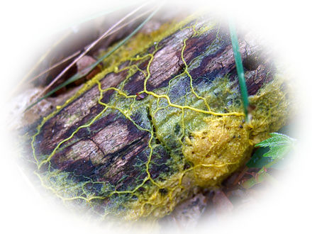

# **Slime Mold Monitoring and Imaging System**
## **LMU EE/CS Department Senior Project**

*Physarum Polycephalum Plasmodium (Slime Mold)*
### Purpose:
Provide LMU Biology Department with a camera system for monitoring the growth of slime mold, 
a simple yet fascinating amoeba.  

<a href= "https://www.youtube.com/watch?v=GwKuFREOgmo" >This video demonstrates slime mold's impressive intelligence.</a>

### Overview: 
This repository contains the code for Raspbeery Pi camera and growth tracking system user interface. 
The system periodically takes pictures of the slime as it grows and then stores the pictures 
locally. Biology department students and staff can access the photos remotely by connecting to the 
Pi with RealVNC viewer or directly from the Pi via keyboard, monitor, and mouse.

### Status:
Currently we are working on maximizing the resolution of the captures.

        

